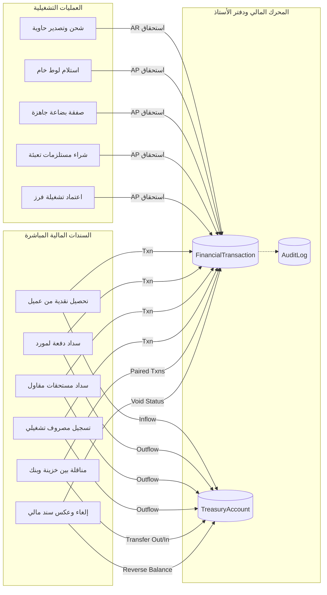

# خريطة تدفق البيانات المالية والربط بين الوحدات (Financial Data Flow & Cross-Module Map)

---

## 1. الكيانات المركزية (Core Domain Entities)

| الكيان (Entity) | الوظيفة ودوره في النظام | مصدر الحقيقة (Source of Truth) |
| :--- | :--- | :--- |
| **`FinancialTransaction`** | سجل دفتر الأستاذ العام الموحد لكافة الحركات والاستحقاقات المالية | **المصدر الأساسي للحقيقة المالية في النظام** (Single Source of Truth) |
| **`TreasuryAccount`** | حسابات الخزائن النقدية والحسابات البنكية الجارية | الرصيد ناتج ومطابق لمجموع حركات `FinancialTransaction` المرتبطة بالحساب |
| **`Customer`** | دليل العملاء الخارجيين والحدود الائتمانية | المديونية والمتبقي مشتق من فواتير الشحن ناقص سندات التحصيل |
| **`Supplier`** | دليل موردي الخامات، البضاعة الجاهزة، ومستلزمات التعبئة | المستحق مشتق من استحقاقات التوريد والشراء ناقص سندات الصرف |
| **`Contractor`** | مقاولو عمالة الفرز والتشغيل بالمحطات | المستحق مشتق من أتعاب التشغيل المقفلة ناقص سندات الصرف |
| **`Shipment`** | الشحنات التصديرية والحاويات المبحرة | تكاليف الشحنة وإيراداتها وهامش ربحها |
| **`RawBatch`** | لوطات الخام الواردة للمحطات | كميات الخام وتكلفة الشراء ورصيد التخزين |
| **`DirectPurchaseDeal`** | صفقات شراء البضاعة الجاهزة المباشرة | كميات وتكاليف البضاعة الجاهزة المودعة |
| **`PackagingPurchase`** | مشتريات الكرتون ومستلزمات التعبئة | كميات ورصيد مستلزمات التعبئة بالمحطة |
| **`ProcessingOperation`** | أوامر تشغيل وفرز الخامات | تكاليف الخام والمستلزمات وأتعاب المقاول |
| **`AuditLog`** | سجل التدقيق والرقابة غير القابل للتعديل | توثيق المستخدم والتاريخ وهوية العملية الملغاة أو المضافة |

---

## 2. مصفوفة العمليات المالية وتدفق البيانات (Financial Operations Matrix)

---

## 3. تفاصيل العمليات والمسارات المتأثرة (Operation Details & Invariants)

### 1. تحصيل عميل (Customer Collection)
* **المصدر (Source)**: سند مالي من شاشة السندات أو كشف حساب العميل.
* **الأثر المالي (Financial Effect)**:
  - زيادة رصيد الخزينة/البنك المختار (`TreasuryAccount.balance += amountEgp`).
  - تسجيل قيد تحصيل في `FinancialTransaction` بالطرف `customerId`.
  - انخفاض الرصيد المتبقي على العميل تلقائياً في كشف الحساب.
* **حدود المعاملة الذرية (Transaction Boundary)**: يتم داخل `prisma.$transaction`.
* **الصلاحية (Permissions)**: `can(role, 'MANAGE_FINANCIALS')` أو `CREATE_COLLECTION`.
* **المسارات المطلوب تحديثها (Revalidation Paths)**:
  - `/financials`, `/financials/transactions`, `/financials/treasury`
  - `/customers`, `/customers/[id]`
  - `/financials/parties/[partyId]`
  - `/reports/aging`, `/reports/profitability`, `/dashboard`

### 2. سداد مورد (Supplier Payment)
* **المصدر (Source)**: سند صرف نقدية / تحويل بنكي لمورد.
* **الأثر المالي (Financial Effect)**:
  - حماية صارمة من السحب على المكشوف: التأكد من أن `TreasuryAccount.balance >= amountEgp`.
  - خصم رصيد الخزينة/البنك ذرياً (`balance: { decrement: amountEgp }`).
  - قيد سند صرف في `FinancialTransaction` بالطرف `supplierId`.
  - انخفاض رصيد المورد المستحق في كشف الحساب.
* **المسارات المطلوب تحديثها (Revalidation Paths)**:
  - `/financials`, `/financials/transactions`, `/financials/treasury`
  - `/suppliers`, `/suppliers/[id]`
  - `/financials/parties/[partyId]`
  - `/reports/suppliers`, `/dashboard`

### 3. تحويل داخلي بين الخزائن والبنوك (Treasury / Bank Transfer)
* **المصدر (Source)**: إجراء تحويل بين حسابين ماليين.
* **الأثر المالي (Financial Effect)**:
  - خصم الحساب المصدر (`sourceAccount.balance -= amountEgp`).
  - زيادة الحساب المستلم (`destAccount.balance += amountEgp`).
  - توليد قيدين متطابقين برمز مرجعي مشترك (`TRF-YYYY-XXXX`):
    - قيد خروج من الحساب المصدر.
    - قيد دخول للحساب المستلم.
  - **قاعدة عدم التأثير (Invariant)**: لا يؤثر التحويل الداخلي نهائياً على المبيعات، أو الأرباح، أو مديونيات العملاء/الموردين.
* **المسارات المطلوب تحديثها (Revalidation Paths)**:
  - `/financials/treasury`, `/financials/transactions`, `/financials`, `/dashboard`

### 4. اعتماد شحنة تصدير (Shipment Dispatch)
* **المصدر (Source)**: معالج اعتماد الشحنات والحاويات.
* **الأثر المالي (Financial Effect)**:
  - توليد فاتورة استحقاق مبيعات تصدير (AR) في `FinancialTransaction`.
  - تسجيل إيراد الشحنة باليورو ومعادلها بالجنيه المصري وسعر الصرف.
  - خصم كميات المنتج التام من المخزن وتسجيل حركات الصرف.
  - إثبات ربحية الشحنة وحساب الهامش.
* **المسارات المطلوب تحديثها (Revalidation Paths)**:
  - `/shipments`, `/inventory`, `/client-orders`
  - `/financials`, `/financials/parties/[customerId]`
  - `/customers`, `/customers/[id]`
  - `/reports/profitability`, `/reports/aging`, `/dashboard`

### 5. إلغاء وعكس السندات والعمليات (Reversal & Cancellation)
* **المصدر (Source)**: إلغاء معتمد من قبل المشرف العام/المدير.
* **الأثر المالي (Financial Effect)**:
  - **ممنوع الحذف الفيزيائي (No Hard Deletes)**: يظل السجل الأصلي محفوظاً وتتحول حالته إلى `'ملغاة'`.
  - عكس الأثر المالي على الخزينة/البنك ذرياً (إذا كان تحصيلاً يتم استرجاعه بشرط كفاية الرصيد، وإذا كان صرفاً يتم إيداعه مجدداً).
  - توثيق سبب الإلغاء وهوية من قام بالإلغاء في `AuditLog`.
* **المسارات المطلوب تحديثها (Revalidation Paths)**:
  - كافة المسارات المرتبطة بالعملية الأصلية عبر `revalidateFinancialImpact()`.

---

## 4. الثوابت والقواعد المالية للنظام (Financial Invariants)

1. **الخزائن والحسابات البنكية**:
   $$\text{الرصيد الحالي} = \text{الرصيد الافتتاحي} + \sum \text{المقبوضات والتحويلات الواردة} - \sum \text{المدفوعات والمصروفات والتحويلات الصادرة}$$
2. **حسابات العملاء (AR)**:
   $$\text{المتبقي على العميل} = \sum \text{فواتير الشحن واستحقاقات التصدير} - \sum \text{سندات التحصيل المعتمدة}$$
3. **حسابات الموردين والمقاولين (AP)**:
   $$\text{المستحق للطرف} = \sum \text{استحقاقات التوريد والشراء والتشغيل} - \sum \text{سندات الصرف والمسدد}$$
4. **ربحية الشحنة (Shipment Profitability)**:
   $$\text{صافي الربح} = \text{إجمالي إيراد الشحن (EGP)} - (\text{تكلفة تصنيع/شراء البضاعة} + \text{مصاريف النقل والنولون والتخليص والشهادات})$$
5. **التعامل مع العملات المتعددة**:
   - العملة الأساسية للحسابات العامة هي الجنيه المصري (`EGP`).
   - يتم تخزين العملة الأصلية (`currency`) والمبلغ الأصلي (`amountCurrency`) وسعر الصرف (`fxRate`) في كل حركة تصدير أو تحصيل عملة أجنبية، مع منع جمع مبالغ عملات مختلفة دون تحويل رسمي.
