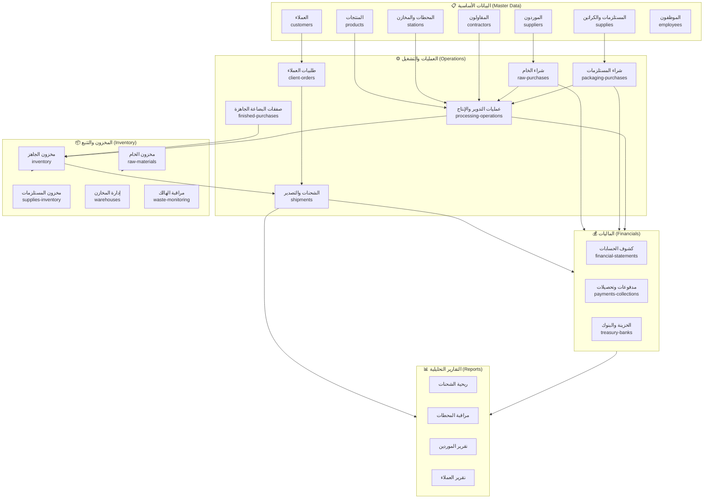

# خريطة الموديولات — Nilotic Frost ERP

## خريطة الموديولات الشاملة



---

## وصف كل موديول

### 1. البيانات الأساسية (Master Data)

| الموديول | الوصف | ملفات HTML |
|---------|-------|-----------|
| **المنتجات** | كتالوج منتجات التصدير المجمدة مع نسب الهالك المعيارية | `products.html`, `product-add.html`, `product-details.html` |
| **المستلزمات** | إدارة الكراتين، الأكياس، البالتات، مواد التغليف | `supplies.html`, `supply-add.html`, `cartons.html`, `carton-add.html` |
| **العملاء** | دليل العملاء الدوليين مع اتفاقيات الأسعار لكل منتج | `customers.html`, `customer-add.html`, `customer-details.html`, `customer-agreements.html` |
| **الموردون** | دليل موردي الخام وموردي البضاعة الجاهزة والمستلزمات | `suppliers.html`, `supplier-add.html`, `supplier-details.html` |
| **المحطات** | محطات التبريد والتجميد مع أسعار التشغيل والمخازن المرتبطة | `stations.html`, `station-add.html`, `station-details.html` |
| **المقاولون** | مقاولو العمالة مع أسعارهم بالكيلوجرام | `contractors.html`, `contractor-add.html`, `contractor-details.html` |
| **الموظفون** | قائمة موظفي الشركة (موديول أساسي) | `employees.html` |

---

### 2. العمليات والتشغيل (Operations)

| الموديول | الوصف | ملفات HTML |
|---------|-------|-----------|
| **شراء الخام** | استقبال توريدات الخام من المزارع مع إنشاء لوطات وقيود مالية تلقائية | `raw-purchases.html`, `raw-arrival-add.html`, `raw-purchase-details.html` |
| **شراء المستلزمات** | استقبال توريدات الكراتين والتغليف مع تحديث المخزون | `packaging-purchases.html`, `supplies-arrival-add.html` |
| **صفقات الجاهز** | شراء بضاعة جاهزة مباشرة من موردين خارجيين | `finished-purchases.html` |
| **عمليات الإنتاج** | تسجيل عمليات الفرز والتدوير والتجميد مع احتساب التكلفة | `processing-operations.html` |
| **طلبيات العملاء** | تسجيل أوامر الشراء من العملاء الدوليين | `client-orders.html` |
| **الشحنات** | تنفيذ الشحنات التصديرية مع تخصيص لوطات وحساب الربح | `shipments.html`, `shipment-create.html`, `shipment-details.html` |

---

### 3. المخزون والتتبع (Inventory & Traceability)

| الموديول | الوصف | ملفات HTML |
|---------|-------|-----------|
| **مخزون الجاهز** | عرض باتشات المنتج الجاهز مع التكلفة والرصيد وشجرة الموردين | `inventory.html` |
| **مخزون الخام** | عرض لوطات المواد الخام برصيدها المتبقي وتكلفتها | `raw-materials.html`, `inventory-raw.html` |
| **مخزون المستلزمات** | كمية الكراتين والتغليف المتاحة | `supplies.html`, `inventory-cartons.html`, `inventory-supplies.html` |
| **إدارة المخازن** | عرض المخازن المرتبطة بالمحطات وسجل الحركات | `warehouses.html`, `warehouse-details.html`, `stock-movements.html` |
| **مراقبة الهالك** | تحليل الهالك الخام والمستلزمات حسب محطة/مورد/شحنة | `waste-monitoring.html` |

---

### 4. الماليات والتحصيلات (Financials)

| الموديول | الوصف | ملفات HTML |
|---------|-------|-----------|
| **كشوف الحسابات** | أرصدة جميع الأطراف (عملاء، موردون، مقاولون) مع تاريخ القيود | `financial-statements.html`, `party-statement-details.html` |
| **مدفوعات وتحصيلات** | سجل كل حركة نقدية دخولاً وخروجاً | `payments-collections.html`, `add-transaction.html`, `payment-details.html` |
| **الخزينة والبنوك** | أرصدة الحسابات البنكية والخزينة الداخلية | `treasury-banks.html`, `treasury-account-details.html` |

---

### 5. التقارير التحليلية (Reports)

| التقرير | الوصف | ملف HTML |
|--------|-------|---------|
| **ربحية الشحنات** | هامش الربح لكل شحنة (إيراد - تكلفة كاملة) | `reports.html` (قيد التطوير في base_prototype) |
| **مراقبة المحطات** | مقارنة أداء المحطات (خام، إنتاج، هالك، ماليات) | `station-monitoring.html` |
| **تقرير الموردين** | حجم الشراء والرصيد المستحق لكل مورد | `supplier-report.html` |
| **تقرير العملاء** | الشحنات والكمية المباعة والمحصّل والربح لكل عميل | `customer-report.html` |

---

## العلاقات الرئيسية بين الموديولات

```
مورد خام ─────→ لوط خام ──→ عملية إنتاج ──→ باتش جاهز ──→ شحنة ──→ إيراد
                    ↓                                            ↓
              قيد مستحق للمورد                        قيد مستحق للعميل
              
مورد مستلزمات ─→ مخزون مستلزمات ──→ عملية إنتاج (استهلاك) ──→ هالك مستلزمات
              
محطة ──→ تحديد سعر التشغيل
مقاول ──→ تحديد أتعاب الكيلو
```
