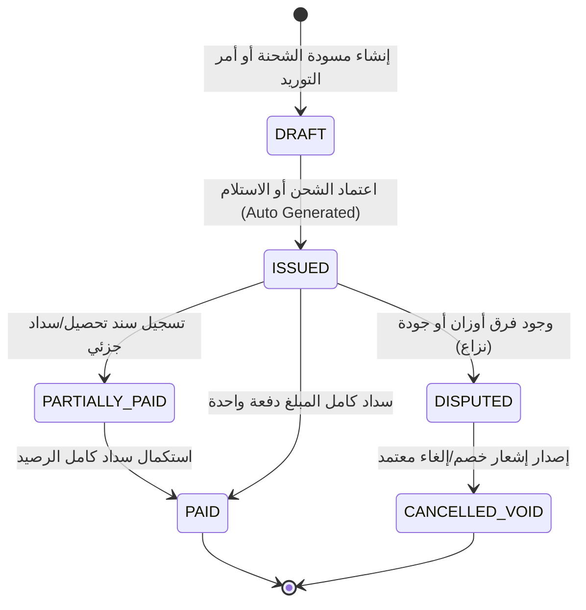

# منطق الفواتير والمطالبات والقيود المالية (Invoicing & Billing Logic)

> **المرجع بالبروتوتايب:**
> - كود المعاملات وتوليد الفواتير: [`base_prototype/js/state.js`](file:///e:/web/exporting_erp/base_prototype/js/state.js#L1066-L1124)
> - شاشة كشف الحسابات ومطالبات العملاء: [`base_prototype/pages/financial-statements.html`](file:///e:/web/exporting_erp/base_prototype/pages/financial-statements.html)
> - شاشة إضافة سند مالي/سداد/تحصيل: [`base_prototype/pages/add-transaction.html`](file:///e:/web/exporting_erp/base_prototype/pages/add-transaction.html)
> - شاشة تفاصيل كشف حساب الطرف: [`base_prototype/pages/party-statement-details.html`](file:///e:/web/exporting_erp/base_prototype/pages/party-statement-details.html)
> - شاشة المدفوعات والتحصيلات: [`base_prototype/pages/payments-collections.html`](file:///e:/web/exporting_erp/base_prototype/pages/payments-collections.html)
> 
> **التطبيق بالنظام الجديد (Next.js + Supabase):**
> - الجدول في Supabase: `financial_transactions`, `treasury_accounts`, `invoices`
> - الـ Server Actions: `actions/financials.ts` -> `generateExportInvoice()`, `recordPaymentVoucher()`, `recordCollectionReceipt()`
> - الـ Route Handler للطباعة: `app/api/export/pdf/invoice/[id]/route.ts`

---

## 1. فلسفة الفوترة في شركات تصدير الحاصلات الزراعية المجمدة

في النظام، لا توجد فواتير معزولة. الفاتورة هي **انعكاس مالي لحظي لحدث تشغيلي معتمد**. تنقسم الفواتير إلى شقين:
1. **فواتير مبيعات التصدير (Export Invoices - AR - Accounts Receivable):** تنشأ تلقائياً عند اعتماد خروج الحاوية وإبحار الشحنة.
2. **فواتير الشراء والتشغيل (Vendor Bills - AP - Accounts Payable):** تنشأ تلقائياً عند استلام لوط خام، استلام مستلزمات، أو اعتماد عملية تدوير وفرز لمقاول.

---

## 2. أنواع المستندات المالية والقيود المولدة

| نوع المستند | الطرف المستهدف | اتجاه الحركة | وقت التوليد التلقائي | كود القيد في البروتوتايب | المعاملة بالنظام الجديد |
| :--- | :--- | :--- | :--- | :--- | :--- |
| **فاتورة مبيعات تصدير تجارية (Commercial Invoice)** | عميل خارجي (Customer) | مدين (AR+) | عند الضغط على "اعتماد الشحنة" في [`shipment-create.html`](file:///e:/web/exporting_erp/base_prototype/pages/shipment-create.html) | `استحقاق مبيعات تصدير (AR)` | `invoices` (type: 'COMMERCIAL_EXPORT') |
| **فاتورة توريد خام زراعي (Raw Receipt Note / Bill)** | مورد خام (Supplier) | دائن (AP+) | عند الضغط على "تسجيل استلام خام" في [`raw-arrival-add.html`](file:///e:/web/exporting_erp/base_prototype/pages/raw-arrival-add.html) | `استحقاق توريد خام (AP)` | `vendor_bills` (type: 'RAW_MATERIAL') |
| **فاتورة توريد مستلزمات كرتون وتغليف (Supplies Bill)** | مورد مستلزمات (Packaging Supplier) | دائن (AP+) | عند تسجيل شراء مستلزم في [`supplies-arrival-add.html`](file:///e:/web/exporting_erp/base_prototype/pages/supplies-arrival-add.html) | `استحقاق توريد مستلزمات (AP)` | `vendor_bills` (type: 'PACKAGING') |
| **مطالبة أتعاب مقاول فرز وتجميد (Contractor Labor Bill)** | مقاول عمالة (Contractor) | دائن (AP+) | عند إقفال واعتماد عملية تدوير في [`processing-operations.html`](file:///e:/web/exporting_erp/base_prototype/pages/processing-operations.html) | `استحقاق تشغيل وفرز (AP)` | `vendor_bills` (type: 'CONTRACTOR_LABOR') |
| **فاتورة شراء صفقة بضاعة جاهزة (Direct Deal Bill)** | مورد جاهز (Trader/Factory) | دائن (AP+) | عند قيد صفقة بضاعة في [`finished-purchases.html`](file:///e:/web/exporting_erp/base_prototype/pages/finished-purchases.html) | `استحقاق شراء صفقة جاهزة (AP)` | `vendor_bills` (type: 'DIRECT_DEAL') |
| **سند تحصيل دفعة مقدمة/شحنة (Collection Receipt)** | عميل خارجي | دائن للعميل / مدين للخزينة (Cash Inflow) | إدخال يدوي من شاشة [`add-transaction.html`](file:///e:/web/exporting_erp/base_prototype/pages/add-transaction.html) | `سند تحصيل دفعة (Inflow)` | `treasury_vouchers` (type: 'COLLECTION') |
| **سند صرف وسداد مستحقات (Payment Voucher)** | مورد / مقاول | مدين للمورد / دائن للخزينة (Cash Outflow) | إدخال يدوي من شاشة [`add-transaction.html`](file:///e:/web/exporting_erp/base_prototype/pages/add-transaction.html) | `سند سداد دفعة (Outflow)` | `treasury_vouchers` (type: 'PAYMENT') |

---

## 3. معادلات احتساب قيم الفواتير بالعملة الأجنبية والجنيه المصري

### أ. فاتورة مبيعات التصدير التجارية (Export Commercial Invoice)
المصدر البرمجي: [`base_prototype/js/state.js` Lines 1030-1080](file:///e:/web/exporting_erp/base_prototype/js/state.js#L1030-L1080)

1. **القيمة بالعملة الأجنبية (EUR/USD):**
   $$\text{Invoice Foreign Amount} = \text{shippedQtyKg} \times \text{unitPriceForeign}$$
   *مثال من البروتوتايب:* $4000\text{ كجم} \times 1.85\text{ EUR} = 7,400.00\text{ EUR}$

2. **سعر الصرف المعتمد (Fixed Contract FX Rate):**
   يُجلب تلقائياً من عقد الطلبية [`client_orders.fx_rate`](file:///e:/web/exporting_erp/base_prototype/js/state.js#L1033) المحفوظ في البروتوتايب (مثلاً: `53.20 EGP/EUR`).

3. **القيمة الإجمالية بالفاتورة بالجنيه المصري (EGP Equivalent):**
   $$\text{Invoice EGP Amount} = \text{Invoice Foreign Amount} \times \text{fxRate}$$
   *مثال:* $7,400\text{ EUR} \times 53.20 = 393,680.00\text{ EGP}$

4. **تحديث رصيد العميل المتراكم (Customer Running Balance):**
   $$\text{Outstanding Balance}_{\text{Customer}} = \sum \text{Invoiced AR} - \sum \text{Collections Inflow}$$

---

### ب. فاتورة استحقاق توريد المواد الخام (Raw Material Receiving Bill)
المصدر البرمجي: [`base_prototype/js/state.js` Lines 660-705](file:///e:/web/exporting_erp/base_prototype/js/state.js#L660-L705)

1. **الوزن الصافي المفوتر (Billed Net Weight):**
   $$\text{Net Billed Weight (kg)} = \text{grossQtyKg} - \text{tareQtyKg}$$
2. **قيمة بضاعة الخام الصافية:**
   $$\text{Raw Goods Total} = \text{Net Billed Weight} \times \text{unitPriceEgp}$$
3. **إجمالي الفاتورة المستحقة للمورد (تشمل النولون إذا كان على الشركة):**
   $$\text{Total Payable AP} = \text{Raw Goods Total} + \text{transportCostEgp}$$
   *مثال من اللوط LOT-RAW-001:* $8000\text{ كجم} \times 18.50\text{ EGP} + 0 = 148,000.00\text{ EGP}$ مستحق للمورد.

---

### ج. مطالبة أتعاب مقاول العمالة والتشغيل (Contractor Tariff Claim)
المصدر البرمجي: [`base_prototype/js/state.js` Lines 850-910](file:///e:/web/exporting_erp/base_prototype/js/state.js#L850-L910)

1. **قاعدة احتساب أتعاب المقاول:**
   المقاول يُحاسب **فقط** على عدد كيلوجرامات المنتج النهائي التام الجاهز الصالح للتصدير ($\text{finishedOutputKg}$)، وليس على وزن الخام الوارد.
2. **معادلة المطالبة:**
   $$\text{Contractor Fee (EGP)} = \text{finishedOutputKg} \times \text{contractorTariffRatePerKg}$$
   *مثال من العملية PR-2026-001:* $4800\text{ كجم جاهز} \times 2.00\text{ EGP} = 9,600.00\text{ EGP}$ تُسجل كقيد استحقاق للمقاول "مقاول أحمد للتجهيز".

---

## 4. دورة حياة الفاتورة وحالاتها (Invoice Lifecycle & State Machine)

### معاني الحالات في قاعدة البيانات Supabase (`invoice_status` ENUM):
1. `DRAFT`: مسودة طلبية أو شحنة لم يتم تأكيد خروجها من المحطة.
2. `ISSUED`: فاتورة معتمدة ولدت القيد المالي في `financial_transactions`.
3. `PARTIALLY_PAID`: تم تحصيل جزء من المبلغ وتبقى رصيد مستحق.
4. `PAID`: الرصيد المستحق = 0.
5. `DISPUTED`: نزاع تجاري (فرق تصافي، رفض كراتين، انخفاض جودة).
6. `CANCELLED_VOID`: ملغاة عبر قيد تسوية عكسي (Reversal Transaction).

---

## 5. قواعد الأمان والتسوية المحاسبية (Accounting Invariants)

1. **ممنوع الحذف المادي للقيود (Immutable Ledger):**
   لا يجوز عمل `DELETE` على أي سجل في جدول `financial_transactions`. أي خطأ يُعالج بإصدار قيد تسوية إشعاري عكسي برقم مرجعي جديد (`REF_REVERSAL_TXN`).
2. **الربط الإلزامي للمستند المرجعي (`refDoc`):**
   كل قيد مالي يجب أن يحمل معرف الكيان التشغيلي الأصلي:
   - فواتير التصدير: `refDoc = "SHP-2026-XXX"`
   - فواتير الخام: `refDoc = "LOT-RAW-YYYYMMDD-XX"`
   - فواتير المستلزمات: `refDoc = "SUP-PUR-2026-XXX"`
   - فواتير المقاولين: `refDoc = "PR-2026-XXX"`
   - سندات التحصيل والسداد: `refDoc = "BANK-TRF-XXXX"` أو رقم الشيك
3. **الحساب المزدوج للأثر المالي في سندات الخزينة:**
   عند قيد سند صرف (`Outflow`):
   - يقل رصيد الخزينة/البنك المحدد (`treasury_accounts.balance -= amount`)
   - يقل الرصيد المستحق للطرف الدائن (`getSupplierBalance(name) -= amount`)
   عند قيد سند قبض (`Inflow`):
   - يزيد رصيد الخزينة/البنك المحدد (`treasury_accounts.balance += amount`)
   - يقل الرصيد المدين على العميل (`getCustomerBalance(name) -= amount`)

---

## 6. نموذج الفاتورة التجارية للطباعة وتصدير PDF (Invoice Layout Spec)

يجب على الموديل عند بناء مسار Next.js (`app/api/export/pdf/invoice/[id]/route.ts`) استخدام `@react-pdf/renderer` لبناء التقرير متضمناً العناصر التالية المستخرجة من البروتوتايب:
- **ترويسة الشركة (Header):** اسم وشعار Nilotic Frost، السجل التجاري، البطاقة الضريبية، العنوان بمصر.
- **بيانات العميل الخارجي:** اسم الشركة، الدولة، ميناء الوصول (`destinationPort`)، كود العميل.
- **بيانات الحاوية واللوجستيات:** رقم الحاوية (`containerNo`)، رقم الختم الجمركي (`sealNo`)، الباخرة والخط الملاحي (`shippingLine`)، رقم الحجز (`bookingNo`).
- **جدول الأصناف المفوترة:**
  - اسم الصنف التجاري بالإنجليزية والعربية (مثال: Frozen Strawberry IQF - فراولة مجمدة تجميد سريع).
  - مواصفات التعبئة (Pack size: 10kg Master Carton).
  - عدد الكراتين والوزن الصافي (Net Weight) والوزن الإجمالي (Gross Weight).
  - سعر الكيلو بالعملة الأجنبية الإجمالية.
- **التذييل والشروط:** بيانات البنك والمصرف المعتمد (CIB EUR IBAN / Swift code)، شرط التسليم (Incoterms 2020: FOB Alexandria Port).
