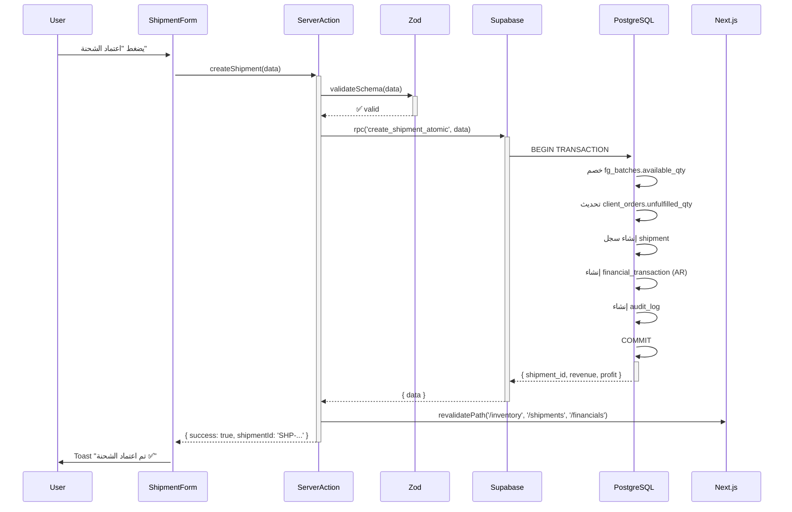

# معمارية النظام الجديد — Next.js + Supabase

## نظرة عامة على المعمارية

```
┌─────────────────────────────────────────────────────────────┐
│                     Next.js App (Vercel)                     │
│                                                              │
│  ┌──────────────┐    ┌──────────────┐    ┌──────────────┐  │
│  │   Server     │    │   Client     │    │   Route      │  │
│  │ Components   │    │ Components   │    │  Handlers    │  │
│  │ (SSR/Static) │    │ (Interactve) │    │ /api/...     │  │
│  └──────┬───────┘    └──────┬───────┘    └──────┬───────┘  │
│         │                   │                   │           │
│  ┌──────▼───────────────────▼───────────────────▼───────┐  │
│  │              Server Actions / Mutations                │  │
│  │  (إنشاء شحنة, تسجيل خام, سداد مورد, ...)            │  │
│  └──────────────────────────┬────────────────────────────┘  │
└─────────────────────────────┼───────────────────────────────┘
                               │
                    ┌──────────▼──────────┐
                    │      Supabase        │
                    │                     │
                    │  ┌───────────────┐  │
                    │  │  PostgreSQL   │  │
                    │  │  + RLS        │  │
                    │  └───────────────┘  │
                    │  ┌───────────────┐  │
                    │  │  Supabase     │  │
                    │  │  Auth         │  │
                    │  └───────────────┘  │
                    │  ┌───────────────┐  │
                    │  │  Storage      │  │
                    │  │  (Files/PDFs) │  │
                    │  └───────────────┘  │
                    │  ┌───────────────┐  │
                    │  │  Realtime     │  │
                    │  │  (Notifs)     │  │
                    │  └───────────────┘  │
                    └─────────────────────┘
```

---

## طبقات النظام

### 1. Server Components (القراءة)

كل صفحات العرض تستخدم Server Components افتراضياً:

```tsx
// app/(dashboard)/inventory/page.tsx
export default async function InventoryPage() {
  const supabase = createServerClient();
  const { data: batches } = await supabase
    .from('finished_goods_batches')
    .select('*, stations(*)')
    .order('production_date', { ascending: false });

  return <InventoryTable batches={batches} />;
}
```

**يُستخدَم لـ:**
- صفحات القوائم (باتشات، شحنات، عملاء...)
- لوحات KPI والتقارير
- كشوف الحسابات والأرصدة

---

### 2. Server Actions (الكتابة)

كل العمليات الـ mutations تُنفَّذ عبر Server Actions:

```tsx
// actions/shipments.ts
"use server";

export async function createShipment(formData: CreateShipmentSchema) {
  const supabase = createServerClient();

  // Transaction ذري عبر PostgreSQL function
  const { data, error } = await supabase.rpc('create_shipment_atomic', {
    order_id: formData.orderId,
    allocated_batches: formData.allocatedBatches,
    costs: formData.costs,
    ...
  });

  // يشمل تلقائياً:
  // - خصم المخزون
  // - تحديث الطلبية
  // - إنشاء القيد المالي AR
  // - تسجيل Audit Log

  revalidatePath('/inventory');
  revalidatePath('/shipments');
  revalidatePath('/financials');
}
```

**يُستخدَم لـ:**
- إنشاء الشحنات ✅
- تسجيل الخام والإنتاج ✅
- الحركات المالية ✅

---

### 3. Route Handlers (للـ Integrations)

```
/api/webhooks/... → webhooks خارجية
/api/export/pdf/[id] → توليد PDF ديناميكي
/api/reports/[type] → بيانات للرسوم البيانية
```

---

### 4. PostgreSQL Functions (العمليات الذرية)

العمليات المركبة التي تلمس جداول متعددة تُنفَّذ كـ PostgreSQL functions لضمان Atomicity:

| الدالة | ما تفعله |
|-------|---------|
| `create_shipment_atomic()` | خصم مخزون + تحديث طلبية + قيد AR — كلها في transaction واحدة |
| `create_processing_operation()` | سحب خام + سحب مستلزمات + إنشاء باتش + قيد AP |
| `add_raw_material_arrival()` | إنشاء لوط + قيد AP |
| `settle_payment()` | سداد + تحديث رصيد حساب |

---

## تدفق تنفيذ الشحنة (مثال كامل)



---

## RTL & Arabic Support

```tsx
// app/layout.tsx
export default function RootLayout({ children }) {
  return (
    <html lang="ar" dir="rtl">
      <body className="font-ibm-plex-arabic">
        {children}
      </body>
    </html>
  );
}
```

---

## Auth Flow مع Supabase

```
1. المستخدم يدخل email + password
2. Supabase Auth يُنشئ session (JWT)
3. Next.js Middleware يقرأ الـ session من cookie
4. يُحدّد الـ role من جدول user_profiles
5. كل Server Component يتحقق من الـ role قبل العرض
6. RLS في Supabase تتحقق تلقائياً من الـ JWT قبل أي query
```
