# مخطط العلاقات بين الجداول (ERD) — Nilotic Frost ERP

## مخطط ERD الشامل

```mermaid
erDiagram
    users {
        VARCHAR id PK
        VARCHAR name
        ENUM role
        VARCHAR title
    }

    customers {
        VARCHAR id PK
        VARCHAR code UK
        VARCHAR name
        VARCHAR country
        VARCHAR destination_port
        VARCHAR currency
        DECIMAL credit_limit
        ENUM status
    }

    customer_agreements {
        SERIAL id PK
        VARCHAR customer_id FK
        VARCHAR product_name
        DECIMAL target_price_eur
        VARCHAR packaging_spec
    }

    suppliers {
        VARCHAR id PK
        VARCHAR code UK
        VARCHAR name
        ENUM type
        VARCHAR product
        ENUM status
    }

    contractors {
        VARCHAR id PK
        VARCHAR name
        DECIMAL tariff_rate_per_kg
        VARCHAR station FK
        ENUM status
    }

    stations {
        VARCHAR id PK
        VARCHAR name UK
        VARCHAR location
        INTEGER cold_storage_capacity_kg
        DECIMAL electricity_rate_per_kg
    }

    products {
        VARCHAR id PK
        VARCHAR name
        VARCHAR code UK
        VARCHAR category
        DECIMAL standard_waste_pct
        DECIMAL standard_yield_pct
    }

    supplies {
        VARCHAR id PK
        VARCHAR code UK
        VARCHAR name
        ENUM category
        DECIMAL stock
        DECIMAL unit_price
    }

    raw_batches {
        VARCHAR batch_id PK
        VARCHAR station_id FK
        VARCHAR supplier_id FK
        VARCHAR raw_product
        DECIMAL initial_qty
        DECIMAL available_qty
        DECIMAL unit_cost
        DATE received_date
        ENUM qc_status
    }

    processing_operations {
        VARCHAR id PK
        DATE date
        VARCHAR station_id FK
        VARCHAR contractor_id FK
        DECIMAL raw_input_kg
        DECIMAL finished_output_kg
        DECIMAL raw_waste_kg
        DECIMAL grand_total_cost
        DECIMAL cost_per_kg
        VARCHAR generated_batch_id FK
        BOOLEAN locked
    }

    operation_raw_issues {
        SERIAL id PK
        VARCHAR operation_id FK
        VARCHAR batch_id FK
        DECIMAL qty
        DECIMAL unit_cost
    }

    operation_supply_issues {
        SERIAL id PK
        VARCHAR operation_id FK
        VARCHAR supply_id FK
        DECIMAL consumed
        DECIMAL waste
        DECIMAL consumed_cost
        DECIMAL waste_cost
    }

    finished_goods_batches {
        VARCHAR fg_batch_id PK
        ENUM source_type
        VARCHAR source_op_id FK
        VARCHAR deal_ref FK
        VARCHAR station_id FK
        VARCHAR product_name
        DATE production_date
        DECIMAL available_qty
        DECIMAL cost_per_kg
        DECIMAL total_value
    }

    direct_purchases {
        VARCHAR deal_id PK
        DATE date
        VARCHAR supplier_id FK
        DECIMAL qty_kg
        DECIMAL cost_per_kg
        VARCHAR generated_batch_id FK
    }

    client_orders {
        VARCHAR order_id PK
        DATE order_date
        VARCHAR customer_id FK
        VARCHAR product_name
        DECIMAL ordered_qty_kg
        DECIMAL unfulfilled_qty_kg
        DECIMAL unit_price_eur
        DECIMAL fx_rate
        VARCHAR status
    }

    shipments {
        VARCHAR shipment_id PK
        VARCHAR order_id FK
        DATE dispatch_date
        DECIMAL shipped_qty_kg
        DECIMAL gross_revenue_egp
        DECIMAL net_profit_egp
        DECIMAL margin_percent
        VARCHAR status
    }

    shipment_allocated_batches {
        SERIAL id PK
        VARCHAR shipment_id FK
        VARCHAR fg_batch_id FK
        DECIMAL qty
        DECIMAL cost_per_kg
    }

    treasury_accounts {
        VARCHAR id PK
        VARCHAR name
        VARCHAR currency
        DECIMAL balance
    }

    financial_transactions {
        VARCHAR txn_id PK
        DATE date
        VARCHAR type
        VARCHAR party_name
        DECIMAL amount_egp
        VARCHAR account_id FK
        VARCHAR ref_doc
        VARCHAR status
    }

    stock_transfers {
        VARCHAR transfer_id PK
        DATE date
        VARCHAR from_station_id FK
        VARCHAR to_station_id FK
        VARCHAR batch_id FK
        DECIMAL qty_kg
    }

    audit_log {
        SERIAL id PK
        VARCHAR entity_type
        VARCHAR entity_id
        VARCHAR action
        VARCHAR performed_by FK
        TIMESTAMP performed_at
    }

    %% Relationships
    customers ||--o{ customer_agreements : "has"
    customers ||--o{ client_orders : "places"
    
    suppliers ||--o{ raw_batches : "delivers"
    suppliers ||--o{ direct_purchases : "sells"
    
    stations ||--o{ raw_batches : "receives"
    stations ||--o{ processing_operations : "hosts"
    stations ||--o{ finished_goods_batches : "stores"
    
    contractors ||--o{ processing_operations : "executes"
    
    raw_batches ||--o{ operation_raw_issues : "used in"
    
    supplies ||--o{ operation_supply_issues : "consumed in"
    
    processing_operations ||--o{ operation_raw_issues : "consumes"
    processing_operations ||--o{ operation_supply_issues : "uses"
    processing_operations ||--|| finished_goods_batches : "generates"
    
    direct_purchases ||--|| finished_goods_batches : "creates"
    
    client_orders ||--o{ shipments : "fulfilled by"
    
    shipments ||--o{ shipment_allocated_batches : "allocates"
    finished_goods_batches ||--o{ shipment_allocated_batches : "allocated to"
    
    treasury_accounts ||--o{ financial_transactions : "records"
    
    users ||--o{ processing_operations : "creates"
    users ||--o{ shipments : "approves"
    users ||--o{ audit_log : "logged in"
```

---

## ملخص العلاقات الرئيسية

| العلاقة | النوع | الوصف |
|--------|------|-------|
| عميل → اتفاقيات | 1:N | كل عميل له اتفاقيات أسعار لمنتجات مختلفة |
| مورد → لوطات خام | 1:N | كل مورد يوفر لوطات متعددة |
| محطة → لوطات خام | 1:N | كل محطة تستقبل لوطات متعددة |
| محطة → عمليات إنتاج | 1:N | المحطة تستضيف عمليات متعددة |
| مقاول → عمليات | 1:N | المقاول ينفذ عمليات متعددة |
| عملية إنتاج → باتش جاهز | 1:1 | كل عملية تُولّد باتش واحد فقط |
| طلبية → شحنات | 1:N | طلبية واحدة قد تُشحن على دفعات |
| شحنة → باتشات | N:M | عبر `shipment_allocated_batches` |
| خزينة/بنك → قيود مالية | 1:N | كل حساب له حركات متعددة |
