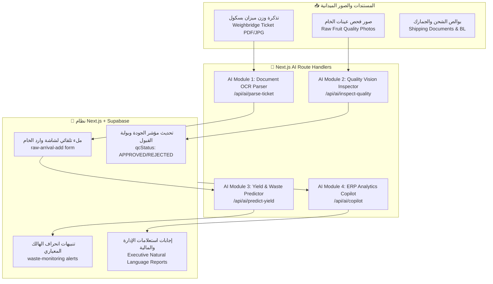

# نظرة عامة على ميزات الذكاء الاصطناعي (AI Features Overview)

> **حالة البروتوتايب الحالي (Source Prototype Verification):**
> تم فحص كود البروتوتايب بالكامل (`base_prototype/` و `bussnislogic_prototype/`)، **ولا يوجد أي كود أو تكامل فعلي مع نماذج ذكاء اصطناعي (AI/LLMs)** في النسخة الحالية. البروتوتايب يعتمد كلياً على منطق رياضي مباشر وقواعد ثابتة (Rule-based deterministic logic) داخل [`base_prototype/js/state.js`](file:///e:/web/exporting_erp/base_prototype/js/state.js).

---

## 1. الغرض من هذا المجلد في النظام الجديد (Next.js + Supabase)

نظراً لأن النظام الجديد يستهدف شركات تصدير زراعية ذات حجم عمليات ضخم، فإن إدخال البيانات يدوياً لكروت الميزان وتفتيش الجودة اليدوي يمثل عنق زجاجة تشغيلي.
يوثق هذا المجلد **المعمارية والمواصفات الكاملة للميزات الذكية المقترحة للنظام الجديد** لتسهيل عمل فريق التطوير عند بناء الـ Next.js Route Handlers المخصصة للذكاء الاصطناعي.

---

## 2. الميزات الذكية المقترحة للنظام الجديد (Proposed AI Modules)

---

## 3. تفصيل الموديولات المقترحة ومساراتها البرمجية

### الموديول 1: استخراج بيانات تذاكر الميزان البسكول تلقائياً (Weighbridge Ticket OCR Parser)
- **المشكلة الحالية بالبروتوتايب:** في شاشة [`base_prototype/pages/raw-arrival-add.html`](file:///e:/web/exporting_erp/base_prototype/pages/raw-arrival-add.html)، يقوم أمين المخزن بإدخال الوزن القائم والوزن الفارغ ورقم السيارة واسم السائق يدوياً، مما يؤدي لأخطاء كتابية تضر بالقيود المالية للموردين.
- **الحل بالذكاء الاصطناعي:**
  - واجهة رفع صورة التذكرة بكاميرا الهاتف أو الماسح الضوئي.
  - استدعاء Route Handler: `POST /api/ai/parse-weighbridge-ticket`.
  - استخراج: الوزن القائم (`grossQty`), الوزن الفارغ (`tareQty`), صافي الوزن (`netQty`), رقم لوحة السيارة (`truckPlate`), والتاريخ.
  - الملء التلقائي للحقول مع إمكانية المراجعة البشرية (Human-in-the-loop validation).

---

### الموديول 2: مساعد فحص الجودة البصري (Fruit Quality Vision Inspector)
- **المشكلة الحالية بالبروتوتايب:** فحص الجودة في البروتوتايب هو مجرد حقل نصي `qcStatus: "APPROVED"` دون أي توثيق مرئي أو معايير رقمية في [`base_prototype/js/state.js` Line 158](file:///e:/web/exporting_erp/base_prototype/js/state.js#L158).
- **الحل بالذكاء الاصطناعي:**
  - التقاط 3 صور لعينة الصندوق عند الاستلام بالمحطة.
  - استدعاء Route Handler: `POST /api/ai/inspect-quality`.
  - تحليل درجة النضج، تجانس الحجم، نسبة الحبات التالفة/المعطوبة، ومقارنتها بمواصفات الصنف التصديري (IQF Grade 1).
  - إعطاء مؤشر تلقائي مقترح للقبول مع إرفاق الصور المحفوظة في Supabase Storage بملف اللوط `raw_batches`.

---

### الموديول 3: التنبؤ بمعدلات الإنتاجية وتكاليف الهالك (Predictive Yield & Waste Forecaster)
- **المشكلة الحالية بالبروتوتايب:** حساب الهالك يتم بأثر رجعي فقط بعد انتهاء أمر التشغيل في [`base_prototype/pages/waste-monitoring.html`](file:///e:/web/exporting_erp/base_prototype/pages/waste-monitoring.html).
- **الحل بالذكاء الاصطناعي:**
  - تحليل بيانات المورد التاريخية (المزرعة، الصنف، تاريخ القطف، درجة البريكس).
  - التنبؤ بنسبة الإنتاجية المتوقعة ($\text{Predicted Yield \%}$) قبل بدء التشغيل.
  - إذا كان التنبؤ أقل من المعدل المعياري (Standard Yield 80%)، يُعطى تنبيه لمدير المحطة لتوجيه اللوط لمنتج آخر (مثلاً: توجيهه لـ "فراولة شرائح" أو "عصير" بدلاً من "IQF كامل ممتاز").

---

### الموديول 4: مساعد التقارير والقرارات التصديرية (Executive Natural Language Copilot)
- **المشكلة الحالية بالبروتوتايب:** استخراج تقارير الأرباح والمقارنة بين أداء المحطات يتطلب تصفح جداول متعددة يدوياً.
- **الحل بالذكاء الاصطناعي:**
  - نافذة محادثة ذكية في Header النظام الجديد (`components/layout/copilot-drawer.tsx`).
  - السماح للمدير التنفيذي بكتابة استفسارات مثل: *"ما هي الشحنة الأكثر ربحية لشهر أغسطس؟"* أو *"ما هو إجمالي رصيد مزارع الوادي المستحق في بنك CIB؟"*.
  - ترجمة السؤال إلى استعلام آمن لقاعدة بيانات Supabase (Read-only Postgres Function) وعرض بطاقات KPI وجداول فورية.

---

## 4. معايير التنفيذ والخصوصية (Privacy & Production Guardrails)

1. **الامتثال الصارم لقواعد عدم الهلوسة (Zero Hallucination Tolerance):**
   - يُمنع منعاً باتاً السماح لنموذج الذكاء الاصطناعي بتنفيذ أوامر كتابة مباشرة في قاعدة البيانات دون مراجعة واعتماد صريح من المستخدم المخول (No autonomous database mutations).
2. **عزل البيانات المالية الحساسة:**
   - عند إرسال استفسارات الـ Copilot، لا يتم إرسال أرقام الحسابات البنكية السرية، بل يتم التعامل مع معرّفات مشفرة وأرصدة إجمالية فقط.
3. **التراجع التلقائي (Fallback Mechanism):**
   - في حال انقطاع خدمة الـ AI API، يستمر النظام بالعمل بنسبة 100% في وضع الإدخال اليدوي المعتاد دون توقف لأي شاشة.
