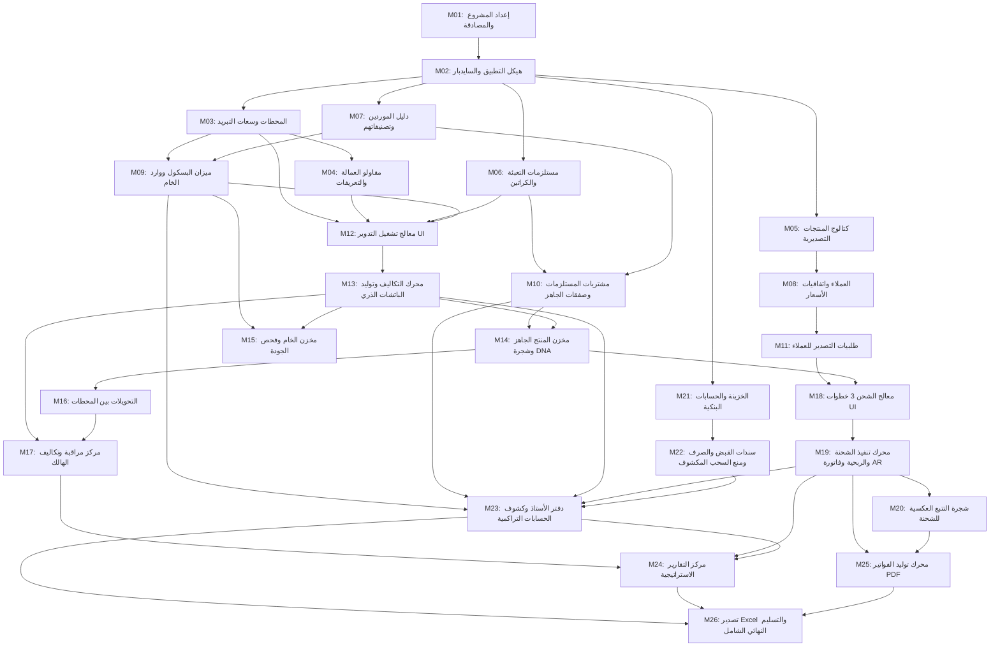

# مصفوفة الاعتمادات والتسلسل المنطقي بين الـ 26 مايلستون (Milestone Dependencies Matrix)

> **إشعار للمشرف والنموذج المنفّذ:**
> يوضح هذا الملف شجرة الاعتمادات المنطقية وسريان البيانات (Data Flow) بين الـ 26 مايلستون التفصيلي لنظام Nilotic Frost ERP، والشروط التي يجب استيفاؤها قبل فتح أي مرحلة لاحقة.

---

## 1. شجرة الاعتمادات وسريان البيانات (Data Flow Diagram)

---

## 2. جدول تفصيل اعتمادات كل مايلستون ومخرجاته

| المايلستون | يعتمد مباشرة على | سبب الاعتماد البيزنسي والتقني | المخرجات التي تفتح المراحل التالية |
| :--- | :--- | :--- | :--- |
| **M01** Setup & Auth | لا يوجد (نقطة البداية) | ضبط اتصال Prisma وإنشاء نموذج المستخدمين | يفتح M02 بتوفير هوية المستخدم المسجل |
| **M02** App Shell | M01 | بناء السايدبار الموحد وشريط التنقل العربي | يفتح صفحات الماستر داتا (M03, M05, M06, M07) |
| **M03** Stations | M02 | تسجيل المحطات وسعات التخزين وتسعيرة الكهرباء | يفتح M04 (ربط المقاولين) و M09 (استلام الخام بالمحطة) |
| **M04** Contractors | M03 | ربط المقاول بالمحطة وحفظ تعريفة أتعاب الفرز | يفتح M12 و M13 (أتعاب المقاول في الإنتاج) |
| **M05** Products | M02 | تكويد الأصناف ونسب التصافي والهالك المعيارية | يفتح M08 (اتفاقيات أسعار الأصناف للعملاء) |
| **M06** Supplies | M02 | كتالوج الكراتين ومواد التعبئة وسعة كل كرتونة | يفتح M10 (شراء كراتين) و M12 (سحب المستلزمات) |
| **M07** Suppliers | M02 | دليل الموردين وتصنيفهم (خام / جاهز / كرتون) | يفتح M09 (توريد الخام) و M10 (شراء المستلزمات) |
| **M08** Customers | M05 | دليل العملاء واتفاقيات أسعار الأصناف باليورو | يفتح M11 (تسجيل طلبيات التصدير) |
| **M09** Weighbridge | M03, M07 | ميزان البسكول واحتساب الصافي وتكلفة الكيلو | يولد لوطات الخام اللازمة لتشغيل المصنع (M12, M15) وقيد AP |
| **M10** Purchases | M06, M07 | شراء الكراتين وصفقات البضاعة الجاهزة المباشرة | يرفع رصيد المستلزمات ويولد باتشات جاهزة (FG-DIR) وقيد AP |
| **M11** Client Orders | M08 | تسجيل طلبيات التصدير وتتبع الرصيد غير المشحون | يوفر طلبيات التصدير المفتوحة لمعالج الشحن (M18) |
| **M12** Processing UI | M03, M04, M06, M09 | معالج خطوات التشغيل والتحقق من رصيد الخام | يجهز واجهة الإدخال للمحرك الذري (M13) |
| **M13** Processing Engine | M12 | خصم الخام والكراتين، حساب التكلفة، وتوليد الباتش | ينشئ باتشات المنتج الجاهز (FG-PR) وقيد المقاول AP |
| **M14** FG Inventory | M10, M13 | عرض باتشات الجاهز المتاحة وشجرة الموردين DNA | يفتح تخصيص الباتشات للشحن (M18) والنقل (M16) |
| **M15** Raw Inventory | M09, M13 | تتبع تناقص رصيد الخام وفحص الجودة والبريكس | يوفر الرقابة على لوطات المزارع بالمخزن |
| **M16** Transfers | M14 | نقل رصيد الباتشات الجاهزة بين المحطات | يصحح خلل البروتوتايب ويوفر الرصيد في محطات الشحن |
| **M17** Waste Hub | M13, M16 | تجميع أرقام الهالك وتكلفته ونسبته للمزارع | يوفر الرقابة الصناعية وتحليلات تقارير الأداء (M24) |
| **M18** Shipment UI | M11, M14 | معالج التصدير: ربط الطلبية وتخصيص الباتشات | يجهز واجهة التصدير للمحرك المالي (M19) |
| **M19** Shipment Engine | M18 | خصم المخزن، حساب الربحية اللحظية، وإصدار AR | يولد فاتورة العميل AR ويسجل أرباح الشحنة |
| **M20** Traceability Tree | M19 | شجرة التتبع العكسية من الحاوية حتى المزرعة | يجهز مستندات الفحص الجمركي لمحرك PDF (M25) |
| **M21** Treasury | M02 | الحسابات البنكية بالعملات (EGP / EUR) والخزينة | يوفر الحسابات البنكية لسندات الصرف والقبض (M22) |
| **M22** Vouchers Engine | M21 | سندات الصرف والقبض ومنع السحب على المكشوف | يحدث رصيد البنوك ويسجل سدادات وتحصيلات الأطراف |
| **M23** General Ledger | M09, M10, M13, M19, M22 | دفتر الأستاذ الموحد وكشوف الحسابات التراكمية | يجمع كل قيود الـ AR والـ AP والسيولة في شاشة واحدة |
| **M24** Strategic Reports | M17, M19, M23 | تقارير الربحية، أداء المحطات، وأعمار الديون | يقدم لوحات القيادة التنفيذية لاتخاذ القرار |
| **M25** PDF Engine | M19, M20 | توليد الفاتورة التجارية الرسمية وشهادة التتبع | يتيح تحميل مستندات التصدير بصيغة PDF معتمدة |
| **M26** Excel & Handover | M23, M24, M25 | تصدير الشيتات وفحص التكامل الشامل `build` | التسليم النهائي والتشغيل الفعلي للنظام بنجاح 100% |

---

## 3. إرشادات التنفيذ المتوازي (Parallel Execution Guidelines)

إذا كان لديك أكثر من وكيل (Subagents) يعملون معاً، فيمكن تنفيذ المسارات المستقلة التالية بالتوازي:
1. **مسار البيانات الأساسية:** يمكن تنفيذ M03 (المحطات) و M05 (المنتجات) و M06 (المستلزمات) و M07 (الموردين) في نفس الوقت فور انتهاء M02.
2. **مسار الخزينة والبنوك:** يمكن تنفيذ M21 (حسابات البنوك) بالتوازي التام مع مسار المشتريات والإنتاج (M09 - M17).
3. **مسار التقارير والـ PDF:** يمكن تنفيذ M24 (التقارير) و M25 (توليد PDF) بالتوازي بمجرد اعتماد أول شحنة في M19 و M20.
