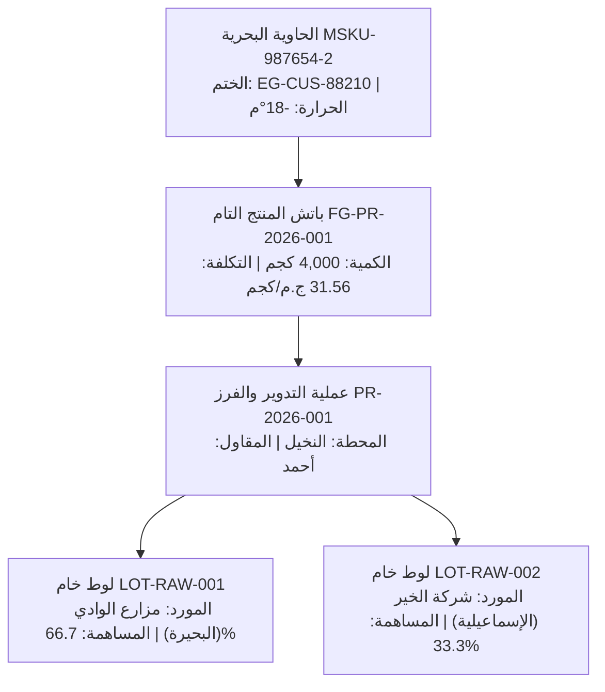

# Milestone 20: شجرة التتبع العكسية للشحنة (Shipment Traceability Tree)

> **المرحلة 20 من 26** — ضمن المرحلة الكبرى السادسة: الشحن والتصدير والربحية
> **بوابة الفحص المرتبطة:** جزء رئيسي من **🛑 Major Checkpoint 4**

---

## 1. الهدف الاستراتيجي
بناء شاشة تفاصيل شحنة التصدير البحرية (`/shipments/[id]`)، وعرض شجرة التتبع الجمركي العكسية الكاملة من الحاوية إلى المزرعة (Farm-to-Container Traceability Tree)، ومراقبة درجات الحرارة لسلسلة التبريد (-18°م)، وتفصيل بنود التكاليف وهوامش الأرباح.

---

## 2. الربط المرجعي بالبروتوتايب الحالي
- **الشاشات المرجعية:**
  - تفاصيل الشحنة وشجرة التتبع: [`base_prototype/pages/shipment-details.html`](file:///e:/web/exporting_erp/base_prototype/pages/shipment-details.html) (718 سطراً)
- **منطق التتبع في البروتوتايب:**
  - قراءة شجرة مصادر الباتشات المسحوبة: [`base_prototype/js/state.js` Lines 990-1035](file:///e:/web/exporting_erp/base_prototype/js/state.js#L990-L1035).

---

## 3. المتطلبات المسبقة (Prerequisites)
- اكتمال **Milestone 19** (تنفيذ الشحنة وتخصيص الباتشات).

---

## 4. نطاق الواجهة والمكونات (UI Scope)

### الملفات المطلوبة:
```
nilotic-frost-erp/
├── app/(dashboard)/shipments/[id]/
│   └── page.tsx                      # شاشة تفاصيل الشحنة الشاملة
├── components/modules/shipments/
│   ├── shipment-header-card.tsx      # بيانات الحاوية والختم وميناء الوصول
│   ├── traceability-tree.tsx         # الشجرة البصرية (حاوية ➔ باتشات ➔ عمليات ➔ لوطات ➔ مزارع)
│   ├── cost-breakdown-card.tsx       # تفصيل بنود التكلفة الستة
│   └── profit-summary-card.tsx       # بطاقة الإيراد والأرباح والهامش
└── lib/data/shipment-dna.ts          # استعلام Prisma لجلب الشجرة العكسية
```

### مستويات شجرة التتبع العكسية (The 4-Tier Tree):


---

## 5. كود استعلام شجرة التتبع بـ Prisma Server Component

```tsx
// app/(dashboard)/shipments/[id]/page.tsx
import { notFound } from 'next/navigation';
import { prisma } from '@/lib/prisma';
import { TraceabilityTree } from '@/components/modules/shipments/traceability-tree';
import { ShipmentHeaderCard } from '@/components/modules/shipments/shipment-header-card';
import { CostBreakdownCard } from '@/components/modules/shipments/cost-breakdown-card';

export default async function ShipmentDetailsPage({ params }: { params: { id: string } }) {
  const shipment = await prisma.shipment.findUnique({
    where: { shipmentId: params.id },
    include: {
      customer: true,
      order: true,
      allocatedBatches: {
        include: {
          batch: {
            include: {
              station: true,
              operation: {
                include: {
                  contractor: true,
                  rawIssues: {
                    include: {
                      rawBatch: {
                        include: { supplier: true }
                      }
                    }
                  }
                }
              }
            }
          }
        }
      }
    }
  });

  if (!shipment) notFound();

  return (
    <div className="space-y-6">
      <ShipmentHeaderCard shipment={shipment} />

      <div className="grid grid-cols-1 lg:grid-cols-3 gap-6">
        <div className="lg:col-span-2 space-y-6">
          {/* شجرة التتبع العكسية */}
          <div className="bg-white p-6 rounded-2xl border border-gray-100 shadow-sm">
            <h3 className="text-lg font-bold text-gray-900 mb-4">شجرة التتبع الجمركي من الحاوية للمزرعة</h3>
            <TraceabilityTree shipment={shipment} />
          </div>
        </div>

        <div className="space-y-6">
          <CostBreakdownCard shipment={shipment} />
        </div>
      </div>
    </div>
  );
}
```

---

## 6. نقطة التفتيش والاختبار (Check Point 20)
1. **اختبار عرض الشجرة العكسية:**
   - فتح صفحة الشحنة `/shipments/SHP-2026-001`.
   - التأكد من قراءة بيانات الحاوية `MSKU-987654-2` والختم `EG-CUS-88210`.
   - التأكد من امتداد الشجرة نزولاً حتى إظهار "مزارع الوادي (البحيرة)" و"شركة الخير (الإسماعيلية)".
2. **التحقق من رابط الفاتورة:**
   - التأكد من ظهور رقم الفاتورة التجارية وزر استعراض القيد المالي في دفتر الأستاذ.

---

## 7. شروط الاكتمال (Definition of Done)
- [ ] شاشة تفاصيل الشحنة تعرض كافة المستويات الأربعة للتتبع الجمركي.
- [ ] بنود التكاليف الستة مفصلة بالأرقام والنسب المئوية.
- [ ] تجهيز الشاشة للربط بمحرك تصدير PDF في المرحلة الثامنة.
