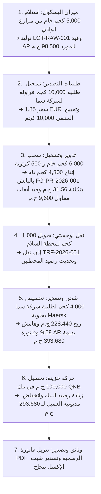

# Milestone 26: تصدير Excel والتسليم النهائي الشامل (Excel Export & Final Handover)

> **المرحلة 26 من 26** — ضمن المرحلة الكبرى الثامنة: التقارير الاستراتيجية ومحرك الوثائق
> **بوابة الفحص المرتبطة:** إتمام واعتماد **🛑 Major Checkpoint 5 (التسليم النهائي)**

---

## 1. الهدف الاستراتيجي
بناء محرك تصدير جداول البيانات والدفاتر المحاسبية إلى صيغة Excel (`.xlsx`) باستخدام مكتبة `xlsx` عبر Next.js Route Handlers، وإجراء اختبار التكامل الشامل من البداية إلى النهاية (End-to-End Test) لكامل الدورة التشغيلية للنظام، والتأكد من نجاح تجميع المشروع الإنتاجي (`next build`) مع تسليم المشروع كاملاً.

---

## 2. الربط المرجعي بالبروتوتايب الحالي
- **الشاشات المرجعية:**
  - أزرار تصدير Excel في جداول المخزون والماليات: [`base_prototype/pages/inventory.html`](file:///e:/web/exporting_erp/base_prototype/pages/inventory.html) و [`financial-statements.html`](file:///e:/web/exporting_erp/base_prototype/pages/financial-statements.html)

---

## 3. المتطلبات المسبقة (Prerequisites)
- اكتمال كافة المايلستونات من **Milestone 01** حتى **Milestone 25**.

---

## 4. مسارات تصدير جداول الـ Excel (`app/api/export/excel/`)

```tsx
// app/api/export/excel/ledger/route.ts
import { NextRequest, NextResponse } from 'next/server';
import * as XLSX from 'xlsx';
import { prisma } from '@/lib/prisma';

export async function GET(request: NextRequest) {
  const transactions = await prisma.financialTransaction.findMany({
    orderBy: { date: 'desc' },
  });

  const data = transactions.map((t) => ({
    'رقم القيد': t.txnId,
    'التاريخ': t.date.toISOString().substring(0, 10),
    'نوع الحركة': t.type,
    'نوع الطرف': t.partyType,
    'اسم الطرف': t.partyName,
    'المبلغ بالجنيه': Number(t.amountEgp),
    'المبلغ بالعملة': t.amountCurrency ? Number(t.amountCurrency) : '',
    'العملة': t.currency,
    'المستند المرجعي': t.refDoc,
    'الحساب المالي': t.accountName || '',
    'البيان والشرح': t.description,
    'الحالة': t.status,
  }));

  const worksheet = XLSX.utils.json_to_sheet(data);
  const workbook = XLSX.utils.book_new();
  XLSX.utils.book_append_sheet(workbook, worksheet, 'دفتر الأستاذ العام');

  const buf = XLSX.write(workbook, { type: 'buffer', bookType: 'xlsx' });

  return new NextResponse(buf, {
    headers: {
      'Content-Type': 'application/vnd.openxmlformats-officedocument.spreadsheetml.sheet',
      'Content-Disposition': 'attachment; filename="General-Ledger.xlsx"',
    },
  });
}
```

---

## 5. اختبار التكامل الشامل لكامل الدورة التشغيلية (E2E Integration Test)

يجب على الموديل أو مهندس الجودة تشغيل سيناريو التحقق الشامل التالي بالترتيب للتأكد من ترابط كل أجزاء النظام:



---

## 6. نقطة التفتيش والاختبار الختامية (Check Point 26)
1. **اختبار تصدير الإكسل:**
   - طلب الرابط `/api/export/excel/ledger` والتأكد من تنزيل ملف `.xlsx` سليم يحتوي على كافة القيود المالية.
2. **اختبار التجميع والإنتاج (Production Build):**
   ```bash
   npm run build
   ```
   - **النتيجة الإلزامية:** خلو كامل من أي خطأ في الـ Typescript أو الـ Linters (`0 errors` و `0 warnings`).
3. **اعتماد واجتياز البوابة الكبرى الخامسة والأخيرة:**
   - باجتياز هذا الفحص، يكون النظام الجديد المبني بـ **Next.js + Prisma + Supabase** قد اكتمل بالكامل بنسبة 100% وجاهزاً للتشغيل الفعلي في الشركة!

---

## 7. شروط الاكتمال (Definition of Done)
- [ ] محرك تصدير Excel يعمل على جداول دفتر الأستاذ والمخزون.
- [ ] الدورة التشغيلية الكاملة (من المزرعة حتى تحصيل الفاتورة) تعمل بسلاسة متناهية وبدون أي ثغرة.
- [ ] اجتياز **🛑 Major Checkpoint 5** واعتماد المشروع النهائي.
