# خارطة الطريق الشاملة وبوابات الفحص والمراجعة (Master Implementation Roadmap & 26 Granular Milestones)

> **إشعار للمشرف والنموذج المنفّذ (Execution Directives for Junior/Cheap LLMs):**
> نظراً لضخامة النظام ودقة العمليات التشغيلية والمحاسبية لشركات تصدير الحاصلات الزراعية، تم تقسيم المشروع هندسياً إلى **26 مايلستون تفصيلي ومركّز (Atomic Milestones)**، بحيث يركز النموذج المنفّذ في كل خطوة على **ملف أو ملفين فقط** دون تشتت أو استهلاك مفرط للذاكرة، وتتخللها **5 بوابات تفتيش كبرى (Major Checkpoints & Quality Gates)**.
> **قاعدة صارمة:** لا يُسمح للنموذج المنفّذ بكتابة أي سطر كود في مايلستون جديد قبل تقديم تقرير باجتياز نقطة الفحص (Check Point) للمرحلة السابقة واعتمادها رسمياً.

---

## 1. شجرة المراحل وبوابات الفحص الكبرى (The 5 Major Quality Gates)

```mermaid
graph TD
    subgraph GATE1["🛑 Major Checkpoint 1: بوابة الأساس والبنية التحتية"]
        M01["M01: إعداد المشروع وقاعدة البيانات والمصادقة وتهيئة shadcn/ui"]
        M02["M02: هيكل التطبيق والسايدبار والهيدر بمكونات shadcn"]
    end

    subgraph GATE2["🛑 Major Checkpoint 2: بوابة البيانات والتوريد والطلبيات"]
        M03["M03: المحطات وسعات التبريد"]
        M04["M04: مقاولو العمالة وتعريفات التشغيل"]
        M05["M05: كتالوج المنتجات التصديرية"]
        M06["M06: مستلزمات التعبئة والتغليف والكراتين"]
        M07["M07: دليل الموردين وتصنيفاتهم"]
        M08["M08: العملاء واتفاقيات أسعار التصدير"]
        M09["M09: ميزان البسكول ووارد المواد الخام"]
        M10["M10: مشتريات المستلزمات وصفقات الجاهز"]
        M11["M11: إدارة طلبيات التصدير للعملاء"]
    end

    subgraph GATE3["🛑 Major Checkpoint 3: بوابة تشغيل المحطات والمخازن والهالك"]
        M12["M12: معالج تشغيل التدوير والفرز UI"]
        M13["M13: محرك التكاليف وتوليد الباتشات الذري"]
        M14["M14: مخزن المنتج التام وشجرة التتبع"]
        M15["M15: مخزن الخام وفحص الجودة"]
        M16["M16: التحويلات اللوجستية بين المحطات"]
        M17["M17: مركز مراقبة وتكاليف الهالك"]
    end

    subgraph GATE4["🛑 Major Checkpoint 4: بوابة الشحن والتصدير والماليات"]
        M18["M18: معالج استخراج شحنة تصدير UI"]
        M19["M19: محرك تنفيذ الشحنة واحتساب الربحية"]
        M20["M20: شجرة التتبع العكسية للشحنة"]
        M21["M21: الخزينة والحسابات البنكية بالعملات"]
        M22["M22: سندات القبض والصرف ومنع السحب المكشوف"]
        M23["M23: دفتر الأستاذ العام الموحد وكشوف الحسابات"]
    end

    subgraph GATE5["🛑 Major Checkpoint 5: بوابة التقارير والوثائق والتسليم النهائي"]
        M24["M24: مركز التقارير الاستراتيجية"]
        M25["M25: محرك توليد الفواتير والوثائق الرسمية PDF"]
        M26["M26: تصدير Excel والتسليم النهائي الشامل"]
    end

    GATE1 --> GATE2
    GATE2 --> GATE3
    GATE3 --> GATE4
    GATE4 --> GATE5

    style GATE1 fill:#1b4332,stroke:#fff,stroke-width:2px,color:#fff
    style GATE2 fill:#1b4332,stroke:#fff,stroke-width:2px,color:#fff
    style GATE3 fill:#1b4332,stroke:#fff,stroke-width:2px,color:#fff
    style GATE4 fill:#1b4332,stroke:#fff,stroke-width:2px,color:#fff
    style GATE5 fill:#0054cd,stroke:#fff,stroke-width:2px,color:#fff
```



---

## 2. الفهرس التفصيلي لجميع الـ 26 مايلستون (All 26 Milestones Directory)

### المرحلة الأولى: التأسيس والبنية التحتية (Foundation & Shell)
| # | المايلستون التفصيلي | نطاق الـ DB | نطاق الـ UI والـ Actions | المرجع بالبروتوتايب |
| :- | :--- | :--- | :--- | :--- |
| **01** | [`milestone-01-core-setup-and-auth.md`](file:///e:/web/exporting_erp/docs/10-implementation/milestone-01-core-setup-and-auth.md) | `UserProfile`, UserRole Enum, Supabase Auth Trigger | تهيئة shadcn/ui، كارت الدخول `/login` (Card, Form, Input, Button)، الـ Middleware | [`base_prototype/index.html`](file:///e:/web/exporting_erp/base_prototype/index.html) |
| **02** | [`milestone-02-app-shell-and-navigation.md`](file:///e:/web/exporting_erp/docs/10-implementation/milestone-02-app-shell-and-navigation.md) | استعلام الأدوار والصلاحيات `can(role, action)` | الـ App Shell بمكونات shadcn (Sheet للموبايل، ScrollArea للسايدبار، DropdownMenu للهيدر، Breadcrumbs) | [`base_prototype/js/navigation.js`](file:///e:/web/exporting_erp/base_prototype/js/navigation.js) |

---

### المرحلة الثانية: البيانات الأساسية والكتالوجات (Master Data Engine)
| # | المايلستون التفصيلي | نطاق الـ DB | نطاق الـ UI والـ Actions | المرجع بالبروتوتايب |
| :- | :--- | :--- | :--- | :--- |
| **03** | [`milestone-03-stations-management.md`](file:///e:/web/exporting_erp/docs/10-implementation/milestone-03-stations-management.md) | نموذج `Station` (سعات التبريد وتسعيرة الكهرباء) | كروت المحطات `/stations`، نموذج الإضافة | [`base_prototype/pages/stations.html`](file:///e:/web/exporting_erp/base_prototype/pages/stations.html) |
| **04** | [`milestone-04-contractors-and-tariffs.md`](file:///e:/web/exporting_erp/docs/10-implementation/milestone-04-contractors-and-tariffs.md) | نموذج `Contractor` وربطه بالمحطة والتعريفة | جدول المقاولين `/contractors`، نموذج الإضافة | [`base_prototype/pages/contractors.html`](file:///e:/web/exporting_erp/base_prototype/pages/contractors.html) |
| **05** | [`milestone-05-products-catalog.md`](file:///e:/web/exporting_erp/docs/10-implementation/milestone-05-products-catalog.md) | نموذج `Product` ونسب الهالك والتصافي المعيارية | كتالوج المنتجات `/products`، نموذج الإضافة | [`base_prototype/pages/products.html`](file:///e:/web/exporting_erp/base_prototype/pages/products.html) |
| **06** | [`milestone-06-packaging-and-supplies.md`](file:///e:/web/exporting_erp/docs/10-implementation/milestone-06-packaging-and-supplies.md) | نموذج `Supply` وسعة الكرتونة والرصيد المتاح | جدول المستلزمات والكراتين `/supplies` | [`base_prototype/pages/supplies.html`](file:///e:/web/exporting_erp/base_prototype/pages/supplies.html) |
| **07** | [`milestone-07-suppliers-directory.md`](file:///e:/web/exporting_erp/docs/10-implementation/milestone-07-suppliers-directory.md) | نموذج `Supplier` وتصنيفات الموردين الثلاثة | جدول الموردين الملون `/suppliers`، فلاتر المحافظات | [`base_prototype/pages/suppliers.html`](file:///e:/web/exporting_erp/base_prototype/pages/suppliers.html) |
| **08** | [`milestone-08-customers-and-agreements.md`](file:///e:/web/exporting_erp/docs/10-implementation/milestone-08-customers-and-agreements.md) | نماذج `Customer` و `CustomerAgreement` باليورو | جدول العملاء `/customers`، نافذة الاتفاقيات | [`base_prototype/pages/customers.html`](file:///e:/web/exporting_erp/base_prototype/pages/customers.html) |

---

### المرحلة الثالثة: المشتريات والتوريد وطلبيات التصدير (Procurement & Orders)
| # | المايلستون التفصيلي | نطاق الـ DB | نطاق الـ UI والـ Actions | المرجع بالبروتوتايب |
| :- | :--- | :--- | :--- | :--- |
| **09** | [`milestone-09-weighbridge-and-raw-receiving.md`](file:///e:/web/exporting_erp/docs/10-implementation/milestone-09-weighbridge-and-raw-receiving.md) | `RawBatch`، قيد استحقاق المورد (AP) تلقائياً | نموذج ميزان البسكول التفاعلي `/raw-purchases/new` | [`base_prototype/pages/raw-arrival-add.html`](file:///e:/web/exporting_erp/base_prototype/pages/raw-arrival-add.html) |
| **10** | [`milestone-10-packaging-and-direct-purchases.md`](file:///e:/web/exporting_erp/docs/10-implementation/milestone-10-packaging-and-direct-purchases.md) | `DirectPurchaseDeal`, زيادة `supplies.stock`, AP | شاشة شراء كراتين، وشاشة صفقات البضاعة الجاهزة | [`base_prototype/pages/packaging-purchases.html`](file:///e:/web/exporting_erp/base_prototype/pages/packaging-purchases.html) |
| **11** | [`milestone-11-export-client-orders.md`](file:///e:/web/exporting_erp/docs/10-implementation/milestone-11-export-client-orders.md) | نموذج `ClientOrder` وتتبع الرصيد غير المشحون | نموذج تسجيل طلبية العميل مع وراثة الأسعار | [`base_prototype/pages/client-orders.html`](file:///e:/web/exporting_erp/base_prototype/pages/client-orders.html) |

---

### المرحلة الرابعة: الإنتاج والتدوير ومحرك التكاليف (Plant Processing)
| # | المايلستون التفصيلي | نطاق الـ DB | نطاق الـ UI والـ Actions | المرجع بالبروتوتايب |
| :- | :--- | :--- | :--- | :--- |
| **12** | [`milestone-12-processing-wizard-ui.md`](file:///e:/web/exporting_erp/docs/10-implementation/milestone-12-processing-wizard-ui.md) | التحقق من رصيد اللوطات والمستلزمات قبل السحب | معالج الـ 4 خطوات التفاعلي والحسابات اللحظية | [`base_prototype/pages/processing-operations.html`](file:///e:/web/exporting_erp/base_prototype/pages/processing-operations.html) |
| **13** | [`milestone-13-processing-engine-and-batching.md`](file:///e:/web/exporting_erp/docs/10-implementation/milestone-13-processing-engine-and-batching.md) | `prisma.$transaction`: خصم الخام والكراتين، توليد `FG-PR-`، قيد أتعاب مقاول | صندوق تكلفة الكيلو الموزونة وشجرة الموردين DNA | [`base_prototype/js/state.js` L780](file:///e:/web/exporting_erp/base_prototype/js/state.js#L780) |

---

### المرحلة الخامسة: المخازن والتتبع اللوجستي والهالك (Warehouses & Waste Hub)
| # | المايلستون التفصيلي | نطاق الـ DB | نطاق الـ UI والـ Actions | المرجع بالبروتوتايب |
| :- | :--- | :--- | :--- | :--- |
| **14** | [`milestone-14-finished-goods-inventory-and-dna.md`](file:///e:/web/exporting_erp/docs/10-implementation/milestone-14-finished-goods-inventory-and-dna.md) | استعلامات الباتشات المتاحة وتفاصيل المزارع | جدول مخزن الجاهز `/inventory`، شارات مساهمة المزارع | [`base_prototype/pages/inventory.html`](file:///e:/web/exporting_erp/base_prototype/pages/inventory.html) |
| **15** | [`milestone-15-raw-inventory-and-qc.md`](file:///e:/web/exporting_erp/docs/10-implementation/milestone-15-raw-inventory-and-qc.md) | تتبع أرصدة لوطات الخام وتناقصها بعد السحب | جدول مخزن المواد الخام `/inventory/raw`، مؤشرات Brix | [`base_prototype/pages/raw-materials.html`](file:///e:/web/exporting_erp/base_prototype/pages/raw-materials.html) |
| **16** | [`milestone-16-inter-station-transfers.md`](file:///e:/web/exporting_erp/docs/10-implementation/milestone-16-inter-station-transfers.md) | نموذج `StockTransfer` وخصم وإضافة الرصيد أتومياً | نافذة التحويل بين المحطات، وسجل أذون النقل | [`base_prototype/pages/stock-movements.html`](file:///e:/web/exporting_erp/base_prototype/pages/stock-movements.html) |
| **17** | [`milestone-17-waste-monitoring-hub.md`](file:///e:/web/exporting_erp/docs/10-implementation/milestone-17-waste-monitoring-hub.md) | استعلامات تجميع الهالك المالي والكمي وربطه بالمزارع | مركز مراقبة الهالك `/inventory/waste` ومقارنة المعياري | [`base_prototype/pages/waste-monitoring.html`](file:///e:/web/exporting_erp/base_prototype/pages/waste-monitoring.html) |

---

### المرحلة السادسة: الشحن والتصدير والربحية اللحظية (Shipments & Export)
| # | المايلستون التفصيلي | نطاق الـ DB | نطاق الـ UI والـ Actions | المرجع بالبروتوتايب |
| :- | :--- | :--- | :--- | :--- |
| **18** | [`milestone-18-shipment-wizard-ui.md`](file:///e:/web/exporting_erp/docs/10-implementation/milestone-18-shipment-wizard-ui.md) | جلب الطلبيات المفتوحة والباتشات الجاهزة المتوافقة | معالج الشحن بـ 3 خطوات `/shipments/new` | [`base_prototype/pages/shipment-create.html`](file:///e:/web/exporting_erp/base_prototype/pages/shipment-create.html) |
| **19** | [`milestone-19-shipment-engine-and-profitability.md`](file:///e:/web/exporting_erp/docs/10-implementation/milestone-19-shipment-engine-and-profitability.md) | `prisma.$transaction`: خصم المخزن، تحديث الطلبية، حساب الربح، وتوليد فاتورة AR | صندوق الربحية اللحظية والهامش، جدول الشحنات | [`base_prototype/pages/shipments.html`](file:///e:/web/exporting_erp/base_prototype/pages/shipments.html) |
| **20** | [`milestone-20-shipment-traceability-tree.md`](file:///e:/web/exporting_erp/docs/10-implementation/milestone-20-shipment-traceability-tree.md) | استعلام شجرة التتبع العكسية من الحاوية حتى المزرعة | شاشة تفاصيل الشحنة `/shipments/[id]` والشجرة البصرية | [`base_prototype/pages/shipment-details.html`](file:///e:/web/exporting_erp/base_prototype/pages/shipment-details.html) |

---

### المرحلة السابعة: المحاسبة والخزينة والأستاذ العام (Financials & Treasury)
| # | المايلستون التفصيلي | نطاق الـ DB | نطاق الـ UI والـ Actions | المرجع بالبروتوتايب |
| :- | :--- | :--- | :--- | :--- |
| **21** | [`milestone-21-treasury-and-bank-accounts.md`](file:///e:/web/exporting_erp/docs/10-implementation/milestone-21-treasury-and-bank-accounts.md) | نموذج `TreasuryAccount` وتعدد العملات (EGP/EUR) | كروت الحسابات البنكية والخزائن ومراقبة السيولة | [`base_prototype/pages/treasury.html`](file:///e:/web/exporting_erp/base_prototype/pages/treasury.html) |
| **22** | [`milestone-22-vouchers-and-overdraft-control.md`](file:///e:/web/exporting_erp/docs/10-implementation/milestone-22-vouchers-and-overdraft-control.md) | قيد السند وتحديث الرصيد ومنع السحب على المكشوف | نموذج سندات الصرف والقبض مع فحص الرصيد اللحظي | [`base_prototype/pages/financial-statements.html`](file:///e:/web/exporting_erp/base_prototype/pages/financial-statements.html) |
| **23** | [`milestone-23-general-ledger-and-statements.md`](file:///e:/web/exporting_erp/docs/10-implementation/milestone-23-general-ledger-and-statements.md) | استعلامات وتجميعات الـ AR والـ AP وسندات الخزينة | دفتر الأستاذ العام الموحد وكشف حساب الطرف التراكمي | [`base_prototype/pages/party-statement.html`](file:///e:/web/exporting_erp/base_prototype/pages/party-statement.html) |

---

### المرحلة الثامنة: التقارير الاستراتيجية ومحرك الوثائق والتسليم (Reports & Handover)
| # | المايلستون التفصيلي | نطاق الـ DB | نطاق الـ UI والـ Actions | المرجع بالبروتوتايب |
| :- | :--- | :--- | :--- | :--- |
| **24** | [`milestone-24-strategic-reports-hub.md`](file:///e:/web/exporting_erp/docs/10-implementation/milestone-24-strategic-reports-hub.md) | استعلامات تقارير الربحية، المحطات، وأعمار الديون | مركز التقارير الموحد والرسوم البيانية التفاعلية | [`base_prototype/pages/reports.html`](file:///e:/web/exporting_erp/base_prototype/pages/reports.html) |
| **25** | [`milestone-25-pdf-documents-engine.md`](file:///e:/web/exporting_erp/docs/10-implementation/milestone-25-pdf-documents-engine.md) | قوالب `@react-pdf/renderer` الرسمية | مسار تحميل الفاتورة `/api/export/pdf/invoice/[id]` | [`base_prototype/pages/shipment-details.html`](file:///e:/web/exporting_erp/base_prototype/pages/shipment-details.html) |
| **26** | [`milestone-26-excel-export-and-final-handover.md`](file:///e:/web/exporting_erp/docs/10-implementation/milestone-26-excel-export-and-final-handover.md) | تصدير دفاتر المحاسبة والمخزون بصيغة `.xlsx` | فحص التجميع النهائي `npm run build` وتسليم النظام | [`base_prototype/pages/inventory.html`](file:///e:/web/exporting_erp/base_prototype/pages/inventory.html) |

---

## 3. تعليمات تكليف النموذج المنفّذ (Prompting Instructions for Junior LLM)

عند تكليف النموذج المنفّذ بأي مايلستون، استخدم صيغة الأمر المحددة التالية:

```markdown
أنت الآن مكلّف بتنفيذ Milestone [رقم المايلستون] فقط لا غير.
1. افتح الملف المرجعي التفصيلي: docs/10-implementation/milestone-[رقم]-....md
2. لا تقم بكتابة أي كود يخص مايلستون آخر.
3. التزم تماماً بنماذج Prisma المحددة وملفات الـ Zod Schemas ومكونات shadcn/ui الرسمية والـ Server Actions المكتوبة في الملف.
4. بعد الانتهاء، قم بتشغيل سيناريو الاختبار المذكور في فقرة Check Point وقدم تقريراً بنتائجه.
```
